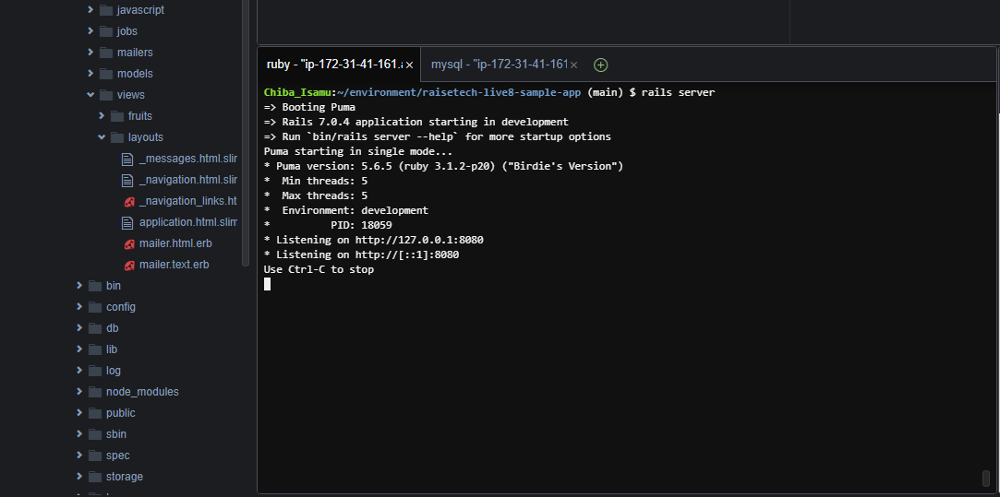

# 第３回課題

## サンプルアプリケーションを起動（デプロイ）し、ブラウザでアクセスする

## APサーバーについて調べる
### APサーバーの名前とバージョンを確認する

### APサーバーを終了させた場合、引き続きアクセスできるか確認する

## DBサーバーについて調べる
### DBサーバー（DBエンジン）の名前とバージョンを確認する

### DBサーバーを終了させた場合、引き続きアクセスできるか確認する

## Railsの構成管理ツールの名前を確認する
- ツール名：Bundler
## 今回の課題から学んだことを報告する
- Webアプリケーションの起動に必要なことを学習した
- サーバー、フロント、データベースの多くの知識が必要だと痛感
- 環境構築の際、エラーが出てきた際に対応できるような知識を付けておく必要がある