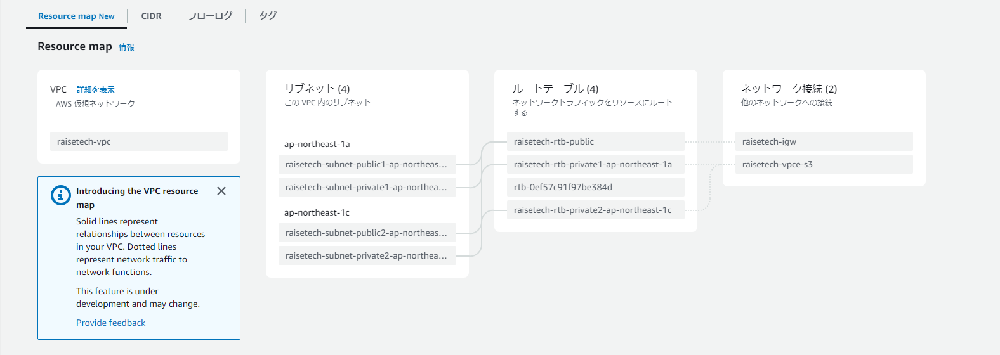

# 第4回課題

## VPC設定

- 追加分

## EC2設定

- 追加分

## RDS設定

- 追加分

## EC2からRDSへ接続

## メモ
- EC2を違うVPCで作ってしまい、それに気づくのに時間がかかった。
- DBにつなげようとしたところ以下のエラーが出てきてしまい、
- セキュリティグループの見直しで時間がかかった。
- ERROR 2003 (HY000): Can't connect to MySQL server on 'database-1.c37ertscx9vr.ap-northeast-1.rds.amazonaws.com' (110)
- 何回もEC2を作り直し、その都度セキュリティグループを作成していたため、うまく接続できなかった。
とりあえず3つ分セキュリティグループ（インバウンド）に入れている
- DBに接続したところ「Welcome to the MariaDB monitor.」と出てきた。
- 調べたところ、MariaDBに標準で搭載されているコマンドラインツール。
- なぜそれがMariaDB monitorが出てくるかは不明。
- プロンプトにはMySQL [(none)]>と出てきているので、とりあえずは気にせず進める。
